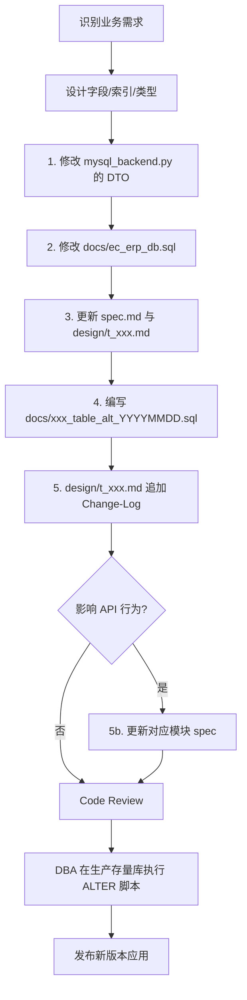

# 数据模型规约（Data Model）

## 模块概述

EC-ERP-Server 使用 SQLAlchemy 1.4.51 ORM + MySQL（PyMySQL 驱动），所有数据模型集中在 [ec_erp_api/models/mysql_backend.py](../../../ec_erp_api/models/mysql_backend.py)，建表 SQL 维护在 [docs/ec_erp_db.sql](../../../docs/ec_erp_db.sql)。

本规约定义：
- 数据表通用约定（命名、字段、索引、字符集）
- 11 张核心表的索引（每张表的详细 SQL 与 DTO 见 [design/](./design/)）
- **数据库结构变更管理规约**（每次库表调整必须遵循的更新流程与 change-log 要求）

## 命名约定（强制）

| 类型 | 约定 | 示例 |
| ---- | ---- | ---- |
| 表名 | `t_` 前缀 + snake_case | `t_user_info`、`t_purchase_order` |
| 字段名 | `F` 前缀 + snake_case | `Fuser_name`、`Fproject_id` |
| 索引名 | `idx_` + 字段简称 | `idx_supplier_name`、`idx_create_time` |
| DTO 类名 | PascalCase（部分历史无 `Dto` 后缀） | `UserDto`、`SupplierDto`、`PurchaseOrder` |
| 主键 | 单列：autoincrement int 或 string；复合主键使用 `PrimaryKeyConstraint` | - |
| 字符集 | 表默认 `utf8`；个别字段使用 `utf8mb4_bin`（如长文本 JSON） | - |
| 引擎 | `InnoDB` | - |

### 已知历史例外（不建议新增同类例外）

- `t_purchase_order.op_log` 列名缺少 `F` 前缀
- `t_sale_order.Fsale_sku_list`：ORM 为 JSON、SQL 为 `LONGTEXT utf8mb4_bin`
- `ProjectDto` 未定义 `columns` 列表（使用 `DtoUtil.to_dict` 时必须传入 `columns`）

## DtoBase 与 DtoUtil

```python
DtoBase = sqlalchemy.orm.declarative_base()

class DtoUtil:
    @classmethod
    def to_dict(cls, o, columns=None) -> dict
    @classmethod
    def from_dict(cls, o, doc: dict)
    @classmethod
    def copy(cls, src, dst)
```

约束：
- `to_dict`：未传 `columns` 时使用 `o.columns`；`datetime` 格式化为 `"%Y-%m-%d %H:%M:%S"`
- 所有新增 Dto **必须**显式定义 `columns: List[str]`
- 业务表**必须**包含 `Fproject_id`、`Fcreate_time`、`Fmodify_time`（拣货 / 打印任务表除外）

## 通用字段（业务表标配）

| 字段 | 类型 | 用途 | 必备性 |
| ---- | ---- | ---- | ------ |
| `Fproject_id` | String(128) | 多 project 隔离 | 业务表必填（用户表通过 `default_project_id` + `roles` 表达） |
| `Fcreate_time` | DateTime, index | 创建时间 | 必填，默认 `CURRENT_TIMESTAMP` |
| `Fmodify_time` | DateTime, index | 修改时间 | 必填，`ON UPDATE CURRENT_TIMESTAMP` |
| `Fis_delete` | int | 逻辑删除（0 / 1） | 业务表必填（拣货 / 打印任务表无此字段） |
| `Fversion` | int | 乐观锁版本号 | 业务表必填（拣货 / 打印任务表无此字段） |
| `Fmodify_user` | String(128) | 修改人（user_name） | 业务表必填（拣货 / 打印任务表无此字段） |

## 数据表清单（11 张）

每张表的详细 SQL、DTO、字段说明、索引及 change-log 见 `design/` 子目录。

| # | 表名 | DTO 类 | 主键 | 详细文档 |
| - | ---- | ------ | ---- | -------- |
| 1 | `t_project_info` | `ProjectDto` | `Fproject_id` | [design/t_project_info.md](./design/t_project_info.md) |
| 2 | `t_user_info` | `UserDto` | `Fuser_name` | [design/t_user_info.md](./design/t_user_info.md) |
| 3 | `t_supplier_info` | `SupplierDto` | `Fsupplier_id` | [design/t_supplier_info.md](./design/t_supplier_info.md) |
| 4 | `t_sku_info` | `SkuDto` | `(Fproject_id, Fsku)` | [design/t_sku_info.md](./design/t_sku_info.md) |
| 5 | `t_sku_purchase_price` | `SkuPurchasePriceDto` | `(Fproject_id, Fsku, Fsupplier_id)` | [design/t_sku_purchase_price.md](./design/t_sku_purchase_price.md) |
| 6 | `t_purchase_order` | `PurchaseOrder` | `Fpurchase_order_id` | [design/t_purchase_order.md](./design/t_purchase_order.md) |
| 7 | `t_sku_sale_estimate` | `SkuSaleEstimateDto` | `(Fproject_id, Forder_date, Fsku, Fshop_id)` | [design/t_sku_sale_estimate.md](./design/t_sku_sale_estimate.md) |
| 8 | `t_sku_picking_note` | `SkuPickingNote` | `(Fproject_id, Fsku)` | [design/t_sku_picking_note.md](./design/t_sku_picking_note.md) |
| 9 | `t_order_print_task` | `OrderPrintTask` | `(Fproject_id, Ftask_id)` | [design/t_order_print_task.md](./design/t_order_print_task.md) |
| 10 | `t_sku_sale_price` | `SkuSalePrice` | `(Fproject_id, Fsku)` | [design/t_sku_sale_price.md](./design/t_sku_sale_price.md) |
| 11 | `t_sale_order` | `SaleOrder` | `Forder_id` | [design/t_sale_order.md](./design/t_sale_order.md) |

## t_sku_info 打包体积字段要求

### Requirement: `t_sku_info` 必须支持打包体积字段

`t_sku_info` SHALL 包含 3 个字段，用于记录每个采购单位打包后的物理尺寸，单位固定为 cm。

| 字段 | 类型 | 必填 | 默认值 | 说明 |
| ---- | ---- | ---- | ------ | ---- |
| `Fsku_pack_length` | INT | 是 | 0 | 打包长度（cm） |
| `Fsku_pack_width` | INT | 是 | 0 | 打包宽度（cm） |
| `Fsku_pack_height` | INT | 是 | 0 | 打包高度（cm） |

约束：
- 字段语义为每个采购单位（`Fsku_unit_name`，含 `Fsku_unit_quantity` 个 SKU）的打包尺寸，不是单个 SKU 自身尺寸。
- 默认值 0 表示未填写，不参与体积计算。
- 字段类型 SHALL 为 `INT NOT NULL DEFAULT 0`。
- DDL 中 3 个字段 SHALL 紧跟在 `Fsku_unit_quantity` 之后。
- `SkuDto` ORM SHALL 同步新增 3 个字段并加入 `columns` 列表，确保 `DtoUtil.to_dict` 输出 `sku_pack_length`、`sku_pack_width`、`sku_pack_height`。

#### Scenario: 新建库执行主 SQL
- **WHEN** 在新国家库执行最新 `docs/ec_erp_db.sql`
- **THEN** `t_sku_info` 表 SHALL 包含 `Fsku_pack_length`、`Fsku_pack_width`、`Fsku_pack_height` 3 列
- **AND** 类型 SHALL 为 `INT NOT NULL DEFAULT 0`
- **AND** 注释分别为"打包长度（cm）"、"打包宽度（cm）"、"打包高度（cm）"。

#### Scenario: 存量库执行 ALTER 脚本
- **WHEN** 在已有数据的国家库执行 `docs/sku_info_table_alt_<YYYYMMDD>_add_pack_volume.sql`
- **THEN** 3 个字段 SHALL 被新增，且既有数据行的 3 个字段值 SHALL 为 0
- **AND** 该脚本 SHALL 是幂等的，重复执行不应报错。

#### Scenario: ORM 与 SQL 双写一致
- **WHEN** 通过 `SkuDto(...)` 构造对象并经 `DtoUtil.to_dict` 序列化
- **THEN** 输出 dict SHALL 包含 `sku_pack_length`、`sku_pack_width`、`sku_pack_height` 3 个 key
- **AND** `SkuDto.columns` 列表 SHALL 包含上述 3 个字段名。

### Requirement: `t_sku_info` Change-Log 必须记录打包体积字段新增

[openspec/specs/data-model/design/t_sku_info.md](./design/t_sku_info.md) 文件 SHALL 在 `## Change-Log` 章节追加一条"新增打包体积字段"的记录，并同步更新 `## CREATE TABLE`、`## 字段说明`、`## DTO 类` 章节。

#### Scenario: design 文档同步更新
- **WHEN** 阅读 `openspec/specs/data-model/design/t_sku_info.md`
- **THEN** `## CREATE TABLE` 章节 SHALL 出现新增 3 个字段
- **AND** `## 字段说明` 表 SHALL 出现新增 3 行
- **AND** `## DTO 类` 章节 SHALL 出现新增字段定义且 `columns` 列表内含新字段
- **AND** `## Change-Log` 章节 SHALL 追加变更类型、原因、内容、ALTER 脚本、回滚方式。

### Requirement: SKU 同步不得覆盖打包体积字段

`auto_sync_tools/sync_sku_inventory.py` 与 `/erp_api/supplier/sync_all_sku` 在同步库存、销量、ERP 信息时 SHALL NOT 覆盖 `Fsku_pack_length`、`Fsku_pack_width`、`Fsku_pack_height`。

#### Scenario: 同步任务保留体积字段旧值
- **WHEN** 一行 SKU 的 `Fsku_pack_length=30`、`Fsku_pack_width=20`、`Fsku_pack_height=15`，触发 `sync_all_sku` 或定时任务 `sync_sku_inventory`
- **THEN** 该行 3 个体积字段 SHALL 保持为 30、20、15，不被清零或更改。

## 多 Project 数据隔离

- `request_context.get_backend()` 按 `session["project_id"]` 缓存独立 `MysqlBackend` 实例（缓存 1800 秒）
- 工具脚本通过 `big_seller_util.build_backend(project_id)` 创建无 session 耦合的实例
- **所有跨 project 查询禁止**，必须显式传 `project_id`
- 业务表 CRUD 方法内部均会校验 `project_id == self.project_id`

支持的 project_id：`philipine`、`india`、`malaysia`、`thailand`，其他用于 `dev` 测试。

## 金额单位约定

| 表 / 字段 | 单位 | 说明 |
| --------- | ---- | ---- |
| `t_sku_purchase_price.Fpurchase_price` | **分（INT）** | 采购价 |
| `t_purchase_order.Fsku_amount` / `Fpay_amount` | **分（INT）** | 采购单金额 |
| `t_sku_sale_estimate.Fsale_amount` / `Fcancel_amount` / `Frefund_amount` / `Fefficient_amount` | **分（INT）** | 销售估算 |
| `t_sku_sale_price.Funit_price` | **元（Float）** | 销售单价（差异点） |
| `t_sale_order.Ftotal_amount` | **元（Float）** | 销售订单总额（差异点） |

> **新增金额字段必须采用分（INT）约定**，禁止使用 Float 表示金额。差异字段为历史遗留，不建议新增同类。

## 索引规范

- 频繁过滤字段加 `index=True`（ORM）/ 对应 `idx_*` 索引（SQL）
- 复合主键使用 `PrimaryKeyConstraint`
- 大字段（如 `VARCHAR(1024)+`）建立索引时使用前缀索引（如 `Fsku_name(255)`）
- **不**使用外键约束，关联通过应用层校验

## 字符集

- 全表默认 `CHARSET=utf8`，`ENGINE=InnoDB`
- 大字段（如 `t_sale_order.Fsale_sku_list`）使用 `LONGTEXT utf8mb4_bin`
- 表级声明：`__table_args__ = {"mysql_default_charset": "utf8"}`

---

# 数据库结构变更规约（Database Schema Change Management）

## 总则

EC-ERP-Server 数据库表结构是核心资产，所有变更必须经过严格管理，确保：
- **可追溯**：每次变更都有明确记录
- **可重建**：基于 SQL 文件可以从零完整重建数据库
- **可升级**：DBA 可基于 ALTER 脚本对存量库表平滑升级，不丢失数据
- **同步性**：ORM、SQL、规约、文档同步更新

## 变更场景

涵盖以下所有库表结构调整：

| 场景 | 触发条件 |
| ---- | -------- |
| 新增表 | 添加新业务模块或拆表 |
| 删除表 | 业务下线，需保留旧数据快照 |
| 新增字段 | 业务字段扩展 |
| 修改字段 | 类型 / 长度 / 默认值 / 注释变更 |
| 删除字段 | 字段废弃 |
| 新增 / 修改索引 | 性能优化 |
| 修改主键 | 重大重构（罕见，需慎重） |
| 字符集变更 | 国际化扩展 |

## 变更流程（强制）

每次库表调整必须**同步**完成以下 5 项更新：

### 1. 更新 ORM 模型

文件：[ec_erp_api/models/mysql_backend.py](../../../ec_erp_api/models/mysql_backend.py)

- 修改对应 DTO 类的字段定义
- 同步更新 `columns` 列表
- 必要时更新 `MysqlBackend` 中的 CRUD 方法

### 2. 更新主 SQL 建表脚本

文件：[docs/ec_erp_db.sql](../../../docs/ec_erp_db.sql)

- 修改对应表的 `CREATE TABLE` 语句
- 保持新建库可以一次执行通过
- 包含完整的字段、索引、注释

### 3. 更新 data-model 规约

#### 整体规约

文件：[openspec/specs/data-model/spec.md](./spec.md)（本文件）

- 字段总览（金额单位约定、命名例外等）有变化时同步更新
- 新增 / 删除表时更新「数据表清单」表格

#### 表级 design 文档

文件：[openspec/specs/data-model/design/t_xxx.md](./design/)

- **必须**更新对应表的 design 文档：
  - 完整 SQL `CREATE TABLE` 语句
  - DTO 类定义（含 `columns`）
  - 字段说明表（中文注释、类型、必填性）
  - 索引清单
  - 业务用途、关联表、CRUD 方法引用
- **必须**在 design 文档末尾的 `## Change-Log` 章节追加一条变更记录

### 4. 编写 ALTER 升级脚本

文件：`docs/<table_name>_table_alt_<YYYYMMDD>_<short_desc>.sql`

或集中管理：`docs/db_migrations/<YYYYMMDD>_<short_desc>.sql`

> 命名约定：以日期 + 简短描述命名，便于按时间序排序执行。

脚本内容必须满足：
- **幂等性**：可重复执行不报错（使用 `IF NOT EXISTS` / `IF EXISTS` / `INFORMATION_SCHEMA` 检查）
- **数据兼容**：包含必要的数据回填语句（如新字段需要默认值，使用 `UPDATE ... SET ... WHERE field IS NULL`）
- **包含注释**：说明本次变更的业务背景、风险点、回滚方式
- **多 project 支持**：明确说明每个国家/地区的数据库需要分别执行

历史例子：[docs/purchase_order_table_alt.sql](../../../docs/purchase_order_table_alt.sql)

```sql
ALTER TABLE t_purchase_order ADD COLUMN `Forder_type` INT NOT NULL DEFAULT 1
  COMMENT '采购单类型, 1: 境内进货采购单, 2: 境外线下采购单' AFTER `Fproject_id`;
ALTER TABLE t_purchase_order ADD INDEX `idx_order_type` (`Forder_type`);
UPDATE t_purchase_order SET Forder_type = 1 WHERE Forder_type IS NULL;
```

### 5. 更新对应模块 spec（如有字段语义变化）

如果字段变更影响 API 行为或业务模块，需同步更新：
- [supplier_module_spec.md](../supplier_module_spec.md)
- [warehouse_module_spec.md](../warehouse_module_spec.md)
- [sale_module_spec.md](../sale_module_spec.md)
- [system_module_spec.md](../system_module_spec.md)

## Change-Log 章节模板（强制）

每个 `design/t_xxx.md` **必须**在文末包含 `## Change-Log` 章节，按时间倒序记录变更：

```markdown
## Change-Log

### 2026-04-29 - <一句话描述本次变更>

**变更类型**：新增字段 / 修改字段 / 删除字段 / 新增索引 / 删除索引 / 其它

**变更原因**：业务背景，例如「支持境外线下采购单类型」

**变更内容**：
- 新增字段 `Forder_type INT NOT NULL DEFAULT 1`
- 新增索引 `idx_order_type`

**新建库**：直接执行 `docs/ec_erp_db.sql` 即包含本次变更。

**存量库 ALTER 脚本**：

```sql
-- 1. 添加新字段
ALTER TABLE t_purchase_order
  ADD COLUMN `Forder_type` INT NOT NULL DEFAULT 1
  COMMENT '采购单类型, 1: 境内进货采购单, 2: 境外线下采购单'
  AFTER `Fproject_id`;

-- 2. 添加索引
ALTER TABLE t_purchase_order ADD INDEX `idx_order_type` (`Forder_type`);

-- 3. 数据回填（如已有数据 Forder_type 为 NULL，统一标记为境内进货）
UPDATE t_purchase_order SET Forder_type = 1 WHERE Forder_type IS NULL;
```

**执行说明**：
- 在每个国家/地区的数据库分别执行：`ec_erp_db_philipine`、`ec_erp_db_india`、`ec_erp_db_malaysia`、`ec_erp_db_thailand`
- 预估执行耗时：< 1 秒（取决于表数据量）
- 风险评估：低风险（新增字段，业务向下兼容）
- 回滚方式：`ALTER TABLE t_purchase_order DROP INDEX idx_order_type, DROP COLUMN Forder_type;`

**关联代码改动**：
- ORM：[ec_erp_api/models/mysql_backend.py](../../../../ec_erp_api/models/mysql_backend.py) `PurchaseOrder.order_type`
- API：[ec_erp_api/apis/supplier.py](../../../../ec_erp_api/apis/supplier.py) `search_purchase_order`、`build_purchase_order_from_req`
- 关联 ALTER 文件：[docs/purchase_order_table_alt.sql](../../../../docs/purchase_order_table_alt.sql)
```

## 变更示例工作流



## DBA 执行检查清单

DBA 在生产环境执行存量库 ALTER 时，必须确认：

- [ ] 该 SQL 已经在测试环境验证通过
- [ ] 已通知相关业务方（影响哪些模块/接口）
- [ ] 已备份对应表的数据（`mysqldump` 或快照）
- [ ] 已估算执行耗时与锁表风险
- [ ] 多 project 部署时，所有相关国家库都已计划执行
- [ ] 回滚脚本已准备并验证
- [ ] 应用版本与库表版本对齐（避免应用读到不存在的字段）

## 强制约束清单

| 约束 | 说明 |
| ---- | ---- |
| 任何库表调整必须同步更新 ORM、SQL、design 文档、ALTER 脚本 | 缺一不可 |
| 每次变更必须在 design/t_xxx.md 追加 Change-Log 条目 | 时间倒序 |
| ALTER 脚本必须幂等 | 可重复执行 |
| ALTER 脚本必须包含数据回填语句（如有需要） | 防止 NULL 异常 |
| ALTER 脚本必须包含回滚方式 | DBA 应急回滚 |
| 新增金额字段必须使用 INT（分）单位 | 不允许 Float |
| 新增字段必须有 `F` 前缀 | 历史例外不扩散 |
| 新增表必须包含 Fproject_id、Fcreate_time、Fmodify_time | 拣货/打印任务表为历史例外 |
| 不引入外键约束 | 关联在应用层校验 |
| 提交代码必须同步更新 docs/ec_erp_db.sql 与 data-model/design/ 文档 | 否则代码评审驳回 |

## 与 OpenSpec 提案流程的关系

涉及数据库结构变更的需求，建议通过 OpenSpec 提案管理：

```bash
# 创建变更提案
openspec propose "<变更描述>"

# 在提案中包含：
# - design/t_xxx.md 的 diff
# - ALTER 脚本
# - 影响范围分析（哪些 API、定时任务受影响）

# 评审通过后归档
openspec apply <change-id>
openspec archive <change-id>
```
